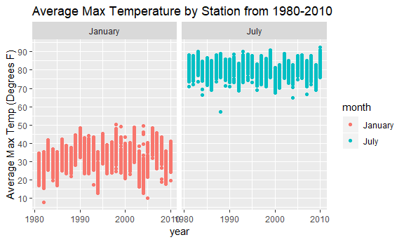

p8105\_hw3\_al3851.Rmd
================

Problem 1
=========

``` r
library(p8105.datasets)
library(tidyverse)
```

    ## -- Attaching packages --------------------------------------------------------------------------------- tidyverse 1.2.1 --

    ## v ggplot2 3.0.0     v purrr   0.2.5
    ## v tibble  1.4.2     v dplyr   0.7.6
    ## v tidyr   0.8.1     v stringr 1.3.1
    ## v readr   1.1.1     v forcats 0.3.0

    ## -- Conflicts ------------------------------------------------------------------------------------ tidyverse_conflicts() --
    ## x dplyr::filter() masks stats::filter()
    ## x dplyr::lag()    masks stats::lag()

``` r
library(ggplot2)
library(tidyverse)
library(scales)
```

    ## 
    ## Attaching package: 'scales'

    ## The following object is masked from 'package:purrr':
    ## 
    ##     discard

    ## The following object is masked from 'package:readr':
    ## 
    ##     col_factor

``` r
library(ggrepel)


knitr::opts_chunk$set(
  fig.width = 6,
  fig.asp = .6,
  out.width = "90%"
)
```

Data Cleaning
-------------

``` r
brfss_df = brfss_smart2010 %>%
  janitor::clean_names() %>%
  filter(topic == "Overall Health") %>%
  filter(response %in% c("Excellent", "Good", "Poor", "Very good", "Fair")) %>%
  mutate(response = factor(response, levels = c("Poor", "Fair", "Good", "Very good", "Excellent"))) %>%
  rename("state" = locationabbr)
```

locations and observations per state
====================================

``` r
locations_sum_df = brfss_df %>%
  group_by(state) %>%
  distinct(locationdesc, keep.all = TRUE) %>%
  summarize(n_locations = n())
  
filter(locations_sum_df, n_locations == 7)
```

    ## # A tibble: 7 x 2
    ##   state n_locations
    ##   <chr>       <int>
    ## 1 CT              7
    ## 2 MT              7
    ## 3 NH              7
    ## 4 NM              7
    ## 5 OR              7
    ## 6 TN              7
    ## 7 UT              7

CT, MT, NH, NM, OR, TN, and Utah all had responses from 7 locations. 7 locations was the mode of the number of locations per state.

Spaghetti Plot
==============

``` r
locations_df = brfss_df %>%
  group_by(state, year) %>%
  distinct(locationdesc, .keep_all = TRUE) %>%
  summarize(n_observations = n())

ggplot(locations_df, aes(x = year, y = n_observations, color = state)) +
  geom_line() +
  labs(title = "Location Number in 2002-2010 by State",
       x = "Year", 
       y = "Number of Locations") +
  scale_color_hue(name = "State")
```


This Spaghetti Plot shows that Florida was an outlier in the number of locations in 2007 and 2010, when there were huge jumps in the number of locations reporting in Florida.

Table
=====

``` r
brfss_excellent_tab = brfss_df %>%
  filter(year %in% c(2002,2006, 2010), state == "NY", response == "Excellent") %>%
  group_by(year) %>%
  summarize(mean = mean(data_value), sd = sd(data_value))
```

The mean proportion of excellent responses decreased from 2002 to 2006, but then it stayed constant.

Make a table showing, for the years 2002, 2006, and 2010, the mean and standard deviation of the proportion of “Excellent” responses across locations in NY State.

Average Proportion
==================

``` r
brfss_prop_av = brfss_df %>%
  group_by(year, state, response) %>%
  summarize(mean_prop = mean(data_value))

ggplot(brfss_prop_av, aes( x = year, y = mean_prop, color = state)) +
  geom_line() +
  facet_grid(~response) +
  theme(legend.position = "bottom")
```

    ## Warning: Removed 3 rows containing missing values (geom_path).


Problem 2
=========

``` r
instacart_df = instacart
```

There are 1384617 rows and 15 columns. Each observation is identified by the columns order\_id and product\_id, so each observation is a particular order of a particular product. Some key variables give information about when an order was made. For example , there is a variable for the day of the week, the hour of the day, as well as the number of days since the last order, for each product in an order. Aside from information about order timing, there are variables about the product. For example, one variable gives the name of the product and another gives the department of the product.

``` r
n_aisles = length(unique(instacart$aisle))

aisle_table = instacart_df %>%
  group_by(aisle_id) %>%
  mutate(n_items = n()) %>%
  distinct(aisle_id, .keep_all = TRUE)

aisle_table_top = aisle_table %>%
  arrange(desc(n_items))
  

ggplot(aisle_table, aes(x = reorder(aisle,n_items), y = n_items, color = department)) +
  geom_point(stat = "identity") + 
  geom_text_repel(data = rbind(head(aisle_table_top,10), tail(aisle_table_top, 10)), aes(x = aisle, y = n_items, label = aisle)) +
  theme(legend.position="bottom")
```


There are 134 aisles.

``` r
item_count = instacart_df %>% 
  filter(aisle %in% c("baking ingredients", "dog food care", "packaged vegetables fruits")) %>%
  group_by(product_id) %>%
  mutate(product_count = n()) %>%
  ungroup() %>%
  group_by(aisle) %>%
  filter(product_count == max(product_count)) %>%
  distinct(product_id, .keep_all = TRUE) %>%
  select(aisle, product_name, product_count)
```

Organic baby spinach is the most popular item of these most popular items in these three isles.

``` r
mean_hour_df = instacart_df %>%
  filter(product_name %in% c("Pink Lady Apples", "Coffee Ice Cream")) %>%
  group_by(order_dow) %>%
  summarize(mean_hour = mean(order_hour_of_day)) %>%
  mutate(order_dow = as.character(order_dow)) %>%
  mutate(order_dow = recode(order_dow, "0" = "Sunday", "1" = "Monday", "2" = "Tuesday", "3" = "Wednesday", "4" = "Thursday", "5" = "Friday", "6" = "Saturday")) %>%
  spread(key = order_dow, value = mean_hour)

rbind(mean_hour_df$order_dow, mean_hour_df$mean_hour)
```

    ## Warning: Unknown or uninitialised column: 'order_dow'.

    ## Warning: Unknown or uninitialised column: 'mean_hour'.

    ## NULL

``` r
mean_hour_switch_df = as.tibble(mean_hour_df$mean_hour)
```

    ## Warning: Unknown or uninitialised column: 'mean_hour'.

``` r
colnames(mean_hour_switch_df) = mean_hour_df$order_dow
```

    ## Warning: Unknown or uninitialised column: 'order_dow'.

The mean hour for every day of the week is in the early afternoon.

Problem 3
=========

Data Cleaning
=============

``` r
ny_noaa_df = ny_noaa %>%
  mutate(year = lubridate::year(date),
         month = lubridate::month(date),
         day = lubridate::day(date)) %>%
  mutate(tmin = as.numeric(tmin) / 10 * (9/5) + 32, tmax = as.numeric(tmax) / 10 * (9/5) + 32) %>%
  mutate(snwd = (as.numeric(snwd) / 10) / 2.54, snow = (as.numeric(snow) / 10) / 2.54) %>%
  mutate(prcp = (as.numeric(prcp) / 100) / 2.54)
```

The ny\_noaa dataframe is 2595176 rows by 10. After converting units, the key variables are the station identification number, the date the weather was recorded, the precipitation (inches) recorded, snow depth (inches) recorded, snowfall recorded (inches), minimum temperature(degrees farenheit) and maximum temperature (degrees farenheit). The fact that there is so much missing data may negatively affect any analysis, since so many stations will be unrepresented in plots and calculations for estimates. For example, if data is missing from stations that get very hot, estimates for mean maximum temperature will be too low.

Average Maximum Temperatures Per Station
========================================

I am grouping by station id, year, and month to get the average maximum temperature for each station in each year in both the months july and january

``` r
average_max_df = ny_noaa_df %>%
  filter(month %in% c(1,7)) %>%
  select(id, month, year, tmax) %>%
  group_by(id, year, month) %>%
  summarize(average_max = mean(tmax, na.rm = TRUE)) %>%
  mutate(month = as.character(month)) %>%
  mutate(month = recode(month, "1" = "January", "7" = "July"))

  ggplot(average_max_df, aes(x = year, y = average_max, color = month)) +
    geom_point() +
    scale_y_continuous(breaks = scales::pretty_breaks(n = 10)) +
    facet_grid(~month) + 
    labs(title = "Average Max Temperature by Station from 1980-2010",
         y = "Average Max Temp (Degrees F)")
```

    ## Warning: Removed 5970 rows containing missing values (geom_point).



It appears as though average maximum temperatures in January tend to have a larger range each year than average maximum temperatures in July. There is more variability in the average maximum temperatures. It looks like there are chuncks of time where changes in average monthly temperature follow the same pattern in July in August, but there are other chuncks where this is not the case (i.e some years values go up and down together but other times they don't ),so it is unclear whether average max temperature in July and June go hand in hand. There are several outliers over the years. In 1982 there was a station about 7 degrees colder than the next lowest station. In 1888 the average max temperature in July was 7 degrees colder than the next highest. It's important to note that there are 5970 observations that are missing.

``` r
library(viridis)
```

    ## Loading required package: viridisLite

    ## 
    ## Attaching package: 'viridis'

    ## The following object is masked from 'package:scales':
    ## 
    ##     viridis_pal

``` r
ggplot(ny_noaa_df, aes(x = tmin, y = tmax)) +
  geom_hex() +
  labs(title = "Minimum vs. Maximum Temp from 1980 to  2010",
       x = "tmin (Celsius)",
       y = "tmax (Celsius)") + 
  scale_fill_viridis()
```

    ## Warning: Removed 1136276 rows containing non-finite values (stat_binhex).


As expected, t\_max is positively associated with t\_min. The relationship between t\_max and t\_min looks approximately linear. The most densly distributed minimum temperatures occur between about 10 and 60 degrees Farenheit and the most densly distributed maximum temperatures occur between 25 and 80 degrees Farenheit. Some areas of density do not make sense. For example, there is one hexagon where minimum temperature is around -10 degrees Farenheit and the maximum temperature is about 135 degrees Farenheit. I searched for this observation or observations in the dataframe, and a situation like this was recorded on January 28, 2005. How is it possible that a station became so hot and so cold on this day in January? Was there a fire at some point in the day in this station?

``` r
ny_noaa_df %>%
  filter(!is.na(snow)) %>%
  filter(snow > 0 & snow < 100) %>%
  ggplot(aes(x = year, y = snow)) +
  geom_hex(bins = 80) +
  labs(title = "Snowfall between 1981 and 2010",
       x = "year",
       y = "snowfall (inches)")
```


I chose to use geom\_hex for this plot as well because it shows the large concentration of very small snowfalls. With geom\_point snowfalls around 10 inches looked just as common as snowfalls very close to zero inches. In this plot I made the bins a smaller size, so that years would be separted. This plot shows that snowfall above 35 inches was rare.
